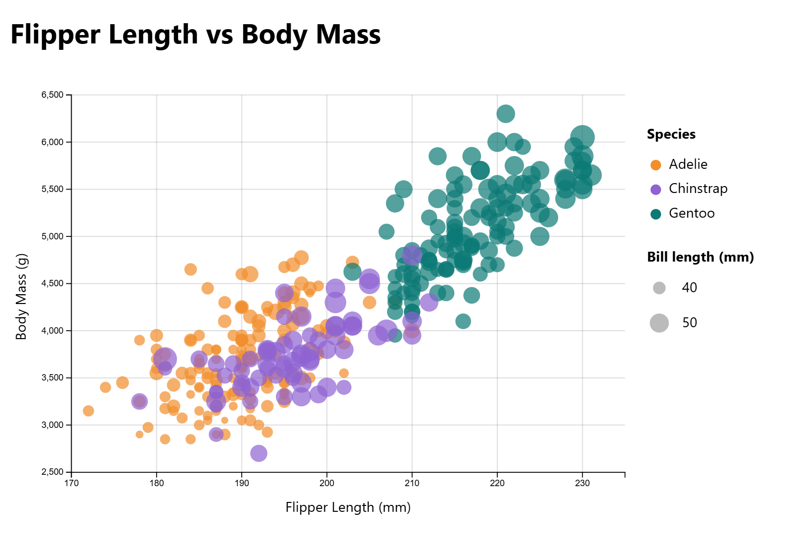
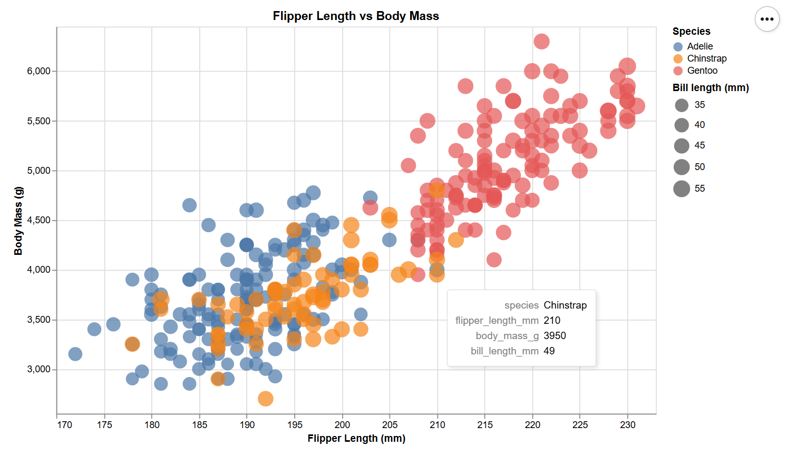
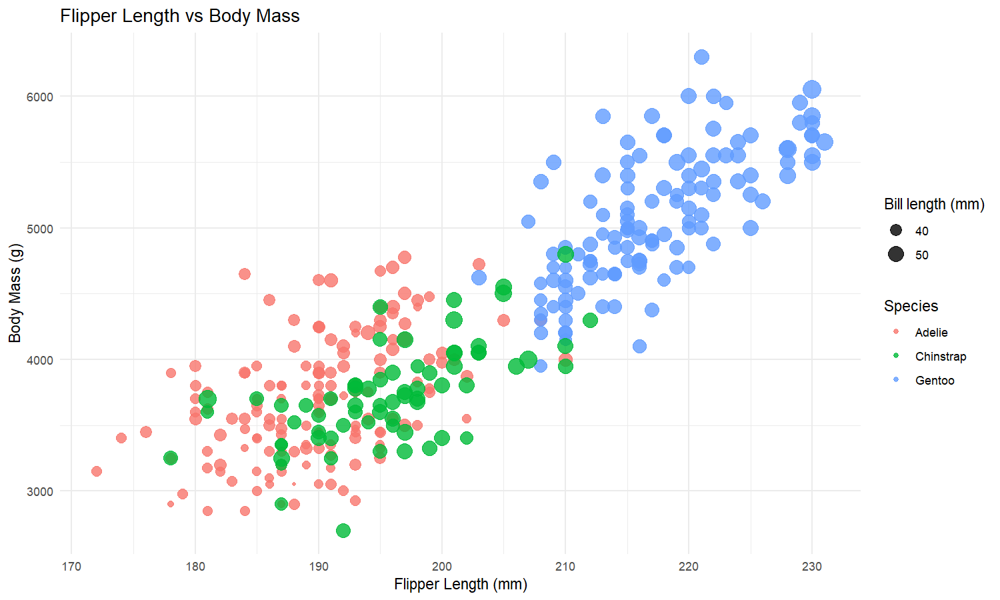
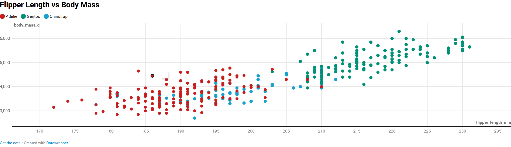
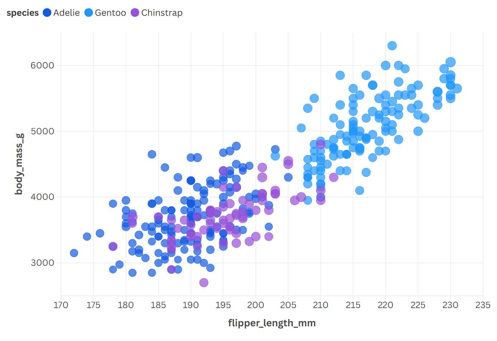

## Technical Achievements

- **Implemented the same visualization across multiple frameworks**  
  The same dataset and variable mappings (flipper length, body mass, species) were recreated across D3.js, Altair, ggplot2, Excel/Datawrapper, and Flourish. This required adapting to different data models, rendering pipelines, and levels of abstraction while preserving visual consistency.

- **Demonstrated cross-tool data encoding equivalence**  
  Each visualization encodes the same core relationships (x/y position and categorical grouping), allowing for direct comparison of how different tools handle scale, aesthetics, and interaction.

- **Handled data cleaning and transformation consistently**  
  Missing values were removed and numeric fields coerced appropriately to ensure comparable outputs across all tools.

---

## Design Achievements

- **Consistent visual language across tools**  
  Despite differences in defaults and capabilities, each visualization maintains a similar layout, axis labeling, and color-by-species encoding to emphasize comparability rather than stylistic divergence.

- **Balanced clarity and interactivity**  
  Static plots (ggplot2, Excel) emphasize readability, while interactive tools (D3.js, Altair, Datawrapper, Flourish) introduce hover and exploration without overwhelming the viewer.

---

# d3.js

Low-level, web-native scatter plot implemented using direct DOM manipulation.  
This version offers maximum control over layout, scales, and interaction at the cost of increased implementation complexity.

---

# Altair

Declarative scatter plot built in Python.  
Altair automatically provides hover-based interactivity and tooltips through its Vega-Lite backend, enabling concise code and expressive visual mappings.

---

# r-ggplot2

Static, programmatic visualization created in R using the Grammar of Graphics.  
This version emphasizes reproducibility and precise aesthetic control, producing publication-quality output through code.

---

# Datawrapper

Web-based interactive scatter plot designed for rapid creation and easy sharing.  
Datawrapper highlights accessibility and clean defaults, allowing for quick deployment with minimal configuration.

---

# Flourish

Interactive, web-native scatter plot with enhanced stylistic flexibility.  
Flourish allows rich visual customization and smooth embedding while remaining approachable for non-programmatic workflows.

